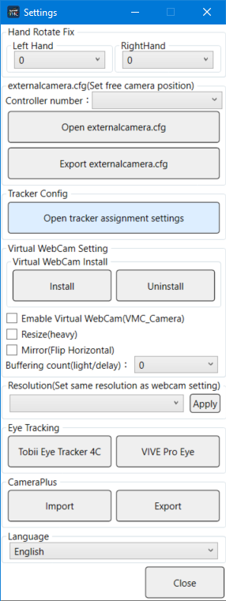
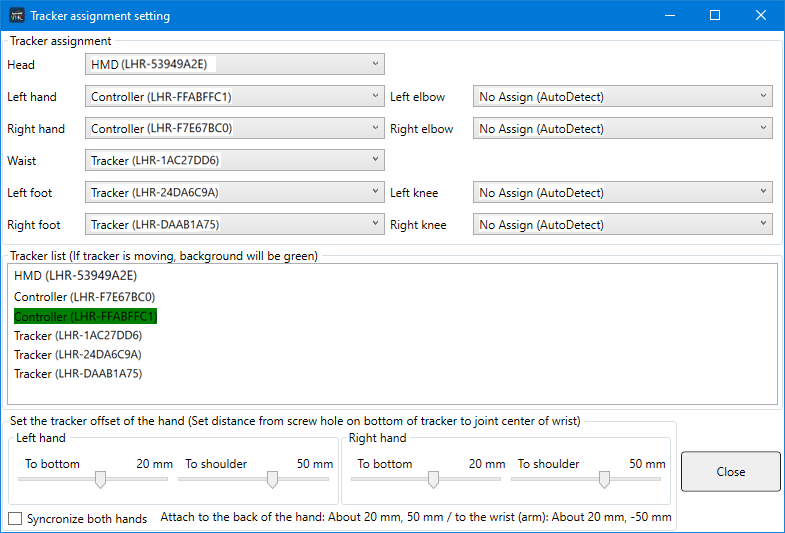

Virtual Motion Capture Basic Operation

## Opening the VRM Model File

Press the Open VRM button and the Import VRM dialog will open.

Press the Import VRM button in the top left and the Open File Dialog will open.

Choose the VRM file you want to open.

Be sure to check the permissions in the license.  If there are no problems, press the Agree / Import button.

The model will be loaded and the program will return to the main screen.

If the model doesn't appear, go to the Camera tab on the Control Panel and choose Front. This will put the model into the middle of the screen.
If the model still doesn't appear there could be a problem with the VRM model. This can happen especially with if it is using a shader that cannot be used with VRM.

Once the model is loaded you need to calibrate it.
On the Settings tab, click on Calibration

Once you click the Calibration button it will calibrate after 5 seconds.

After 5 seconds calibation will start.  This is to correct for the difference between the avatar and the actual body shape.  Reach out your arms to either side and hold the controllers with the palm of your actual hand facing forward.

Do not hold the controller totally vertical or horizontal but naturally at an angle.  This will be the same for the Oculus Touch. During calibration the height of the hands is especially important.  Before calibration, look to your left and right hands and confirm they are level.  If the hands are slightly lower the actual height will be measured incorrectly and afterwards there is a possibility of not matching up within the game.

Once calibration is complete the model on the screen should match your own movements. If the direction of the palms are off, confirm that the calibration is done similar to the image above. You can calibrate as many times as needed so try again if something is off.

Although using just a headset and two controllers will work fine, if you have LIV installed or have multiple trackers for full body tracking it may not autodetect properly.  In that case you can assign the trackers manually.  
First press the Settings button.

In the Settings screen press the Open tracker assignment settings button.

This opens the screen that displays a list of all recognized controllers and trackers and the tracker assignment settings.  
By default everything is set to AutoDetect.

If autodetect doesn't work, manually assign the trackers to each body part.  If you move the tracker it will be highlighted in green allowing you to assign them one by one.  Set the body parts that do not have trackers to "No Assign."

When all the trackers are assigned, close the Settings screen and calibrate again.  If the calibration is successful, the whole body will move.

After confirming that the model is moving properly the next thing to set is for lip sync.
From the control panel go to the LipSync tab and click on the Device drop down list. This shows a list of audio devices available.  Select the device to be used for lip sync.

Once you have selected the device, speak into the mic and the model's mouth should also move.  If it only moves a little or not at all try increasing the microphone sensitivity.

After setting up lip sync, the last thing is the controller settings. Click on the Shortcut key button on the Settings tab.

The default preset is "VRChat+(Vive)." 
If you are using an Oculus Touch or a VRoid model, you will need to change to the appropriate preset.
You can also create your own custom preset by assigning keys yourself.  You can use not just the controllers but also the keyboard allowing you to customize in various ways, such as changing the expression with the keyboard while in a game where you need to use trackers for hands.

Once you have finished changing settings you should save them.  The next time you can use Open settings to load them again so you don't have to set everything up again.

This concludes the basic settings.  From here you can set the background color to green for chroma keying, use the free camera to record from different angles and change other settings to suit your usage.  The next few pages will explain the use of the externalcamera.cfg file to do Mixed Reality Compositing.
