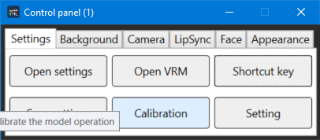
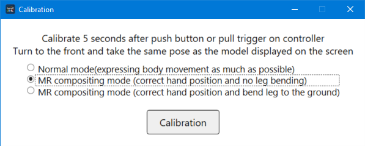
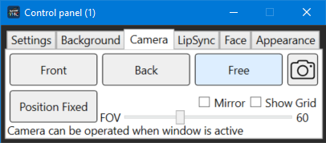
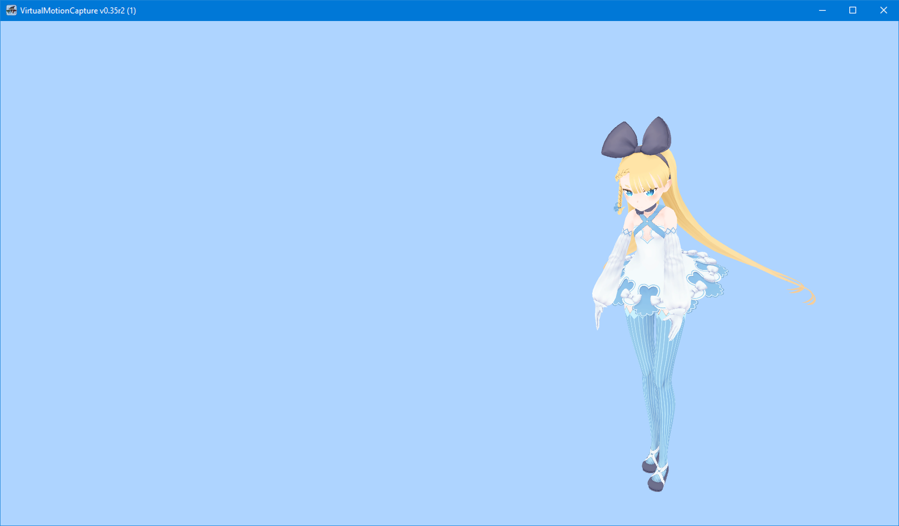
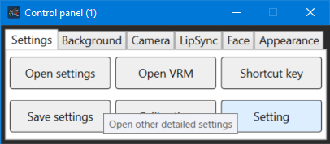
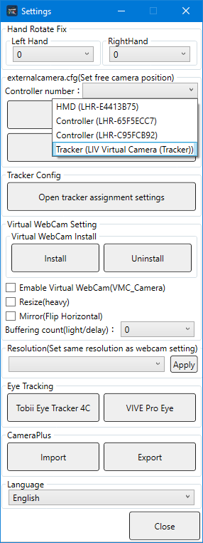
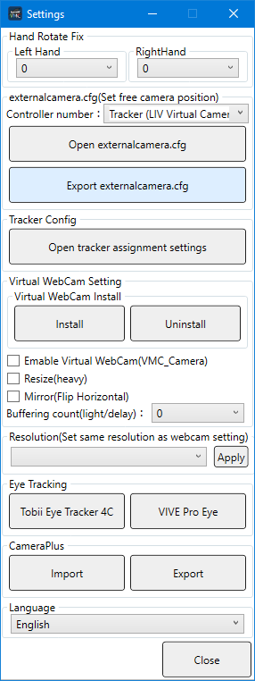
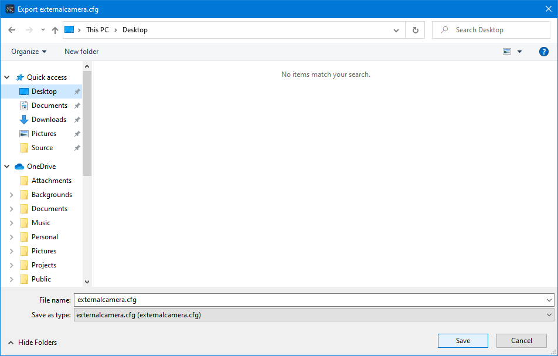

Creating externalcamera.cfg For Mixed Reality Compositing

## What is externalcamera.cfg

In order to capture as if from inside the game (Mixed Reality Compositing), you will need the file, 'externalcamera.cfg' to match the camera orientation of the game and Virtual Motion Capture.
The externacamera.cfg file contains the offset data from the 'third' controller to the camera.  Originally this feature was used to film a person using a video camera and a green screen and composite it into the game.
By attaching a controller to a video camera, you could match the shot of the person playing reality and their position in the game.
Virtual Motion Capture uses this feature to display a 3D model in the same position to composite into the game instead of using a video camera.

Some SteamVR games and also others compatible with LIV can also use this file to do compositing.

After you finish 
[Basic Calibration](./Basic-Operation.html) you will know how to use Virtual Motion Capture and confirm the model is moving appropriately.

To create the externalcamera.cfg file, you need to prepare a third controller or virtual tracker first. Please see the following pages for instructions on how to create a virtual controller.
・[LIV Initial Setup](./LIV-Initial-Setup.html)  
・Installing MixedRealityTwoController (Soon)  
  

## Calibration for Mixed Reality Compositing

Click the Calibration button on the Settings tab of the Control Panel.

Choose one of the two MR compositing mode options.

・ If you choose "MR compositing mode (correct hand position and no leg bending) and if your avatar has longer legs they will go through the ground.  If the ground is transparent like in Beat Saber there will be no problem.

・ If you choose "MR compositing mode (correct hand position and bend leg to the ground) and if your avatar has longer legs, the knees will bend so that the avatar appears to stand on the ground. This prevents the feet from going through the ground like in games like H3VR.

※ If you choose "Normal mode (expressing body movement as much as possible)" it will be okay as long as you are in the center of the play area but as you move the controllers will no longer be matched to your hands.  You will want to use the above two MR compositing modes instead.

## Choose a Camera Orientation

On the Camera Tab of the Control Panel, choose the Free camera option.

On the main window of Virtual Motion Capture (where the model is displayed) you can move the camera with the mouse.  
* You can pan the camera by middle clicking and dragging
* You can rotate the camera by right clicking and dragging
* You can rotate the camera around a central point by Alt-left clicking and dragging
* You can zoom in or out by scrolling up or down on the wheel mouse

You can move the camera anywhere using these four functions.

## Outputting externalcamera.cfg

On the Settings tab of the Control Panel click on the Settings button.

Set the third controller you want to use for the camera with the controller number of externalcamera.cfg (set free camera coordinates). When using LIV, set the controller (LIV Virtual Camera (Controller)) When using MixedRealityTwoController, select the controller (Virtual Controller).

In "externalcamera.cfg(Set free camera position)", choose the controller or tracker to use to represent the camera position.
If you are using LIV, set the controller to Tracker (LIV Virutal Camera(Tracker)). If you are using MixedRealityTwoController, set the controller to Controller (Virtual Controller).

Once you have chosen a controller you can output the externalcamera.cfg file.  Press the "Export externalcamera.cfg" button.

Since the screen to save the file is displayed, save it in the folder of your choice without changing the file name (externalcamera.cfg remains). You will use this file later in the synthesis.

Once you see the Save File Dialog, do not change the file name and save (as externalcamera.cfg) to a folder of your choice.
You will use this file later for Mixed Reality Compositing.

**Do not save the externalcamera.cfg file to the same folder as VirtualMotionCapture.exe!**
**Virtual Motion Capture's screen will be divided into four sections and the program will not work correctly.**

## Compositing within Games

・[Mixed Reality Compositing with LIV and Virtual Motion Capture](./MR-Compositing-with-LIV-and-Virtual-Motion-Capture.html)  
・Mixed Reality Compositing by putting externalcamera.cfg directly into the game folder (currently being written)
