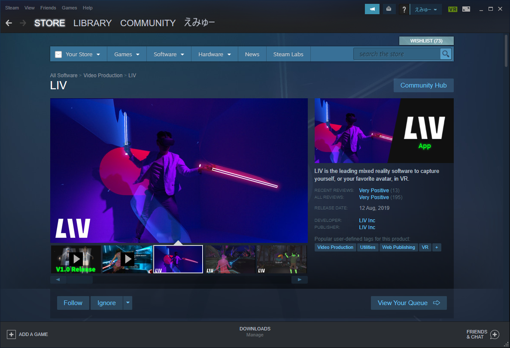
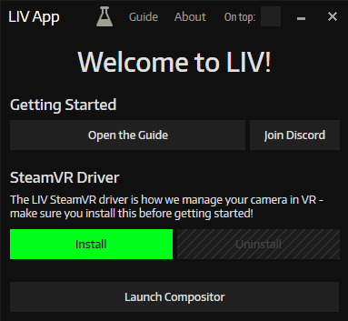
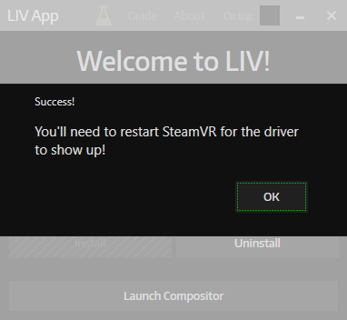
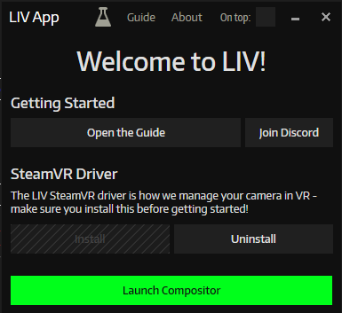
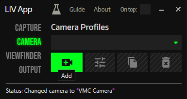
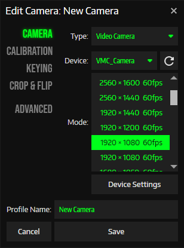

LIV Initial Setup

## What is LIV?

LIV is a free application on Steam that lets you record as if from within a game. (Mixed Reality)
[LIV on Steam](https://store.steampowered.com/app/755540/LIV/) You can install it using Steam here.
From the Steam Store Page video you can see it is an application for filming with a video camera and compositing it into VR.
Instead of using a video camera, Virtual Motion Capture can generate video from 3D models and you can then composite as if the 3D model were in the game.

## Installing the Virtual Motion Capture Virtual Camera Driver

Install the driver onto your PC which allows Virtual Motion Capture to send its video.  You only need to do this procedure once.

1. Start Virtual Motion Capture
1. On the Control Panel, go to the Settings tab and click the Setting button
1. In the Virtual WebCam Setting section, click the Install button and follow the install procedure

## Installing LIV's SteamVR Driver

After installing LIV from Steam, start the program. If Virtual Motion Capture or SteamVR is running please close it. As described in LIV's main screen, you need to install the LIV driver before using it. Click the Install button on the screen to start it.

If the installation is successful the Success dialog will be displayed.  Press OK to continue.

## Setting up the Virtual Web Camera with LIV

1. From the main LIV window press Launch Compositor to open the Compositor window. 

1. On the left click the Camera button and the Camera Profiles tab will show. Click on the Plus button to add a new camera profile. 
  

1. The Edit Camera screen appears allowing you to create a new camera profile.
  * For Type choose Video Camera (Without it following items will not be diplayed)
  * For Device choose VMC_Camera
  * For Mode choose 1920x1080 60fps or 1280x720 60fps
  * For Profile Name you can enter VMC to help you distinguish the camera profiles.

This completes the LIV setup. Next we will create an externalcamera.cfg file with Virtual Motion Capture.
[Creating externalcamera.cfg for MR Compositing](./MR合成用のexternalcamera.cfgの作成.html) 
  
If you already have produced the externalcamera.cfg then skip to here.
[MR Compositing with LIV and Virtual Motion Capture](./LIVとバーチャルモーションキャプチャーでMR合成.html)

### Please Note
* This document was produced with LIV Version 1.3.7 (2020-03-29)
* LIV's functionality and appearance is subject to change due to newer updates
