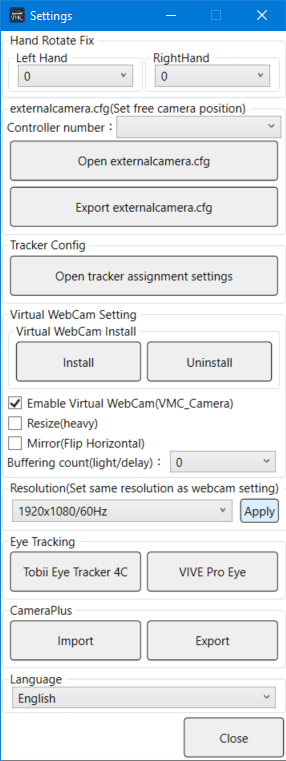

Mixed Reality Compositing with LIV and Virtual Motion Capture

## Advance Preparation

You must set up LIV in advance to film from within a game (Mixed Reality Compositing).
Please take a look at the following guides first.
[LIV Initial Setup](./LIV-Initial-Setup.html)
[Creating externalcamera.cfg for Mixed Reality Compositing](./Creating-externalcamera.cfg-For-Mixed-Reality-Compositing.html)  

## Start Virutal Motion Capture

Start Virtual Motion Capture first and load in the 3D model.  You do not need to calibrate just yet.

## Load externalcamera.cfg into LIV

Start LIV, click Launch Compositor, click Camera on the left tab and then click Edit. 
※ If properly set up beforehand VMC will be the automatically selected Camera Profile so you only need to click Edit.

On the displayed Edit Camera: 
* Select Calibration on the left of the Edit VMC dialog
* Next, above and to the right, make sure the Details is checked (Without it the import UI will not be displayed)
* Click the Import button and choose From file

Select the externalcamera.cfg file that you have prepared beforehand.

If it was loaded correctly Success will be displayed.  Press OK.  (You don't need to save just yet.)

## Setting up the Chroma Key

On the Edit Camera:VMC screen, click on the KEYING tab on the left.  You can change the color to use as the chroma key (the transparent color) for mixed reality compositing with Virtual Motion Capture.  The default background is green (the GB button).  If you are using a model with green and it becomes transparent, you can switch to pink or some other color. Once you have chosen the color click the Save button.

## Setting the Resolution

In the main LIV App window, click on the Output tab to the left to set the output resolution.  Since LIV requires some amount of processing, if your PC is not strong enough you may not be able to use a high resolution.

* The highest resolution should be 1920x1080 with FPS set to 60. Please lower the setting if the movement is laggy.
The standard resolution should be 1280x720 with the FPS at 30. 
If you change the resolution be sure to also change the resolution in the Settings dialog of Virtual Motion Capture to the same value.

## Enable the Web Camera in Virtual Motion Capture

First, for MR compositing, change the background color.  From the Virtual Motion Capture control panel, go to the Background tab and select the same chroma key color set previously.  If using the default green color press the green GB button.  If using another color, right click the Custom button and choose the color you want.  After you've changed the custom color you can just left click to select that color as the background.

Next, go to the Settings tab, click the Setting button and check the Enable Virtual Web Camera (VMC_Camera) checkbox.  Then in the Resolution (Set same resolution as webcam setting) dropdown, select the same resolution as previously set in LIV's camera settings which is usually 1920x080/60hz or 1280x720/60hz.  After you select, click the Apply button and make sure the model display window of Virtual Motion Capture has updated to the specified size.  

※ When the resolution of the monitor is 1920x1080 you may not be able to set the resolution of Virtual Motion Capture to 1920x1080.  In that case, when starting VirutalMotionCapture.exe hold down to the Shift key and a settings dialog will appear.  Uncheck the Windowed checkbox and set the screen resolution to 1920x1080.

## Calibration

From the Settings dialog for the Controller number, choose LIV's Virtual Controller first. Then click the Open externalcamera.cfg button and choose the same externalcamera.cfg file that was loaded into LIV.

Once you have confirmed that the camera is in the correct position, perform calibration with Virtual Motion Capture.  Make sure to choose one of the the MR compositing modes.  (Normal mode will work but the hands will not match up in game.)

## Launch the Game

If the settings are correct you should see the same model in LIV's compositor window with as displayed in Virutal Motion Capture but with a the background chroma-key removed resulting in a black background.

If it is not displayed the resolution is wrong so please check it again. You must use the same resolution in all the places where it is entered.

If there are no problems then click the CAPTURE tab on LIV and choose the game you want to start.  Choose the same Target Resolution as you have selected before and press Sync & Launch.

## If Hands Do Not Align

At this point, in the LIV compositor screen, you will be able to check if the model is displayed in the game.  If not, please check the settings again as there should be a mistake somewhere.

If the hand is not properly aligned (espeically vertically), the calibration was off.  In Virtual Motion Capture's Setting dialog, choose the virtual camera's controller and open the externalcamera.cfg again.

Run the Calibration again.  Even though the game is running you can still calibrate.  Make sure to use the MR compositing mode when calibrating.

## Recording or Streaming

If the settings are correct you will be able to see the game and the model composited together on the screen.  All you have to do is capture and record it.

For example with OBS you can use the source as Game Capture with the mode being Capture specific window.  Select the window to be [capture.exe]: LIV App Output.

